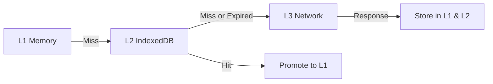

# Architecture

This document describes the current runtime architecture for the vizualni-admin
app and the exported library. It is written for execution: each subsystem
includes concrete entry points and file paths.

## Runtime modes

- Static export (GitHub Pages): Next.js pages are pre-rendered and client-side
  data fetching is used. Next API routes and database-backed features are not
  available.
- Full app (Next.js server): API routes, GraphQL, and database-backed features
  are available. This mode is used for local dev and server deployments.

## System overview

```mermaid
graph TD
  User --> UI[Next.js pages (app/pages)]
  UI -->|REST| DataGov[data.gov.rs API]
  UI -->|GraphQL| GQL[/api/graphql (Apollo Server)]
  GQL --> RDF[SPARQL endpoints via app/rdf]
  GQL --> DB[(PostgreSQL via Prisma)]
  UI --> Charts[D3 charts in app/exports/charts]
  UI --> MapApp[Map features in app/charts/map]
```

Notes:

- Map features in `app/charts/map` use MapLibre/Deck; they are app-only.
- The exported `MapChart` in `app/exports/charts/MapChart.tsx` is D3-based and
  does not depend on MapLibre/Deck.

## Project structure (execution map)

- `app/pages/`: Pages Router entry points, including `pages/api/*` routes.
- `app/components/`: shared UI components and chart controls.
- `app/exports/`: exported library entry points and chart components.
- `app/domain/`: data.gov.rs client and domain logic.
- `app/graphql/`: GraphQL schema, resolvers, and urql client wiring.
- `app/rdf/`: SPARQL query helpers and caching.
- `app/db/`: Prisma-backed persistence with static-build mocks.
- `app/charts/`: app-only charts and map tooling.
- `app/stores/`: zustand stores for cross-component UI state.

## Data.gov.rs integration (REST)

Primary entry points:

- `app/domain/data-gov-rs/client.ts`: REST client for data.gov.rs endpoints.
- `app/domain/data-gov-rs/index.ts`: public API surface for the client.
- `app/hooks/use-data-gov-rs.ts`: app hook for dataset search and resource
  fetch.
- `app/exports/hooks/useDataGovRs.ts`: exported hook for consumers.

Typical flow:

1. UI triggers search or dataset fetch from `useDataGovRs`.
2. `dataGovRsClient` performs REST calls to data.gov.rs endpoints.
3. Results are normalized and passed to chart components or demos.

## GraphQL API (Apollo Server)

Primary entry points:

- `app/pages/api/graphql.ts`: Apollo Server handler for `/api/graphql`.
- `app/graphql/schema.graphql`: schema definition.
- `app/graphql/resolvers/*`: RDF and SQL resolvers.
- `app/graphql/client.tsx`: urql client (cacheExchange + fetchExchange).

GraphQL is used for:

- RDF cube exploration via SPARQL (`app/rdf/*`).
- SQL-backed metadata and config queries.

## Charts and exported library

Library entry points:

- `app/index.ts`: public exports for the npm package.
- `app/exports/`: charts, hooks, utils, and core exports.
- `app/package.json`: `exports` map and entrypoints.
- `app/tsup.config.ts`: library bundling and externalized deps.

Chart implementation:

- D3-based charts in `app/exports/charts/*`.
- `MapChart` is D3-based and safe to export without maplibre dependencies.
- MapChart packaging decision:
  `ai_working/decisions/2026-01-09-mapchart-packaging.md`.
- App-only map features live in `app/charts/map/`.

### Chart plugin system

The chart plugin system enables dynamic registration of custom chart types
without modifying the core bundle. This prevents bundle size bloat and supports
a third-party chart ecosystem.

**Primary entry points:**

- `app/exports/charts/plugin-types.ts`: Plugin interface definitions
  (`IChartPlugin`, `ChartPluginMetadata`, `ChartPluginHooks`)
- `app/exports/charts/chart-registry.ts`: Registry implementation and public API
- `app/exports/charts/examples/RadarChartPlugin.tsx`: Example plugin
  implementation

**Plugin interface:**

A plugin is an object implementing `IChartPlugin<TConfig>` that includes:

- **Metadata**: `id`, `name`, `version`, `author`, `description`, `category`,
  `tags`, `license`, `minCoreVersion`
- **Component**: React component that accepts standard chart props (data,
  config, height, width, locale, callbacks)
- **Optional hooks**: `onRegister`, `onUnregister`, `validateData`,
  `transformData`, `transformConfig`
- **Optional helpers**: `defaultConfig`, `configSchema`, `exampleData`,
  `exampleConfig`

**Registration API:**

```typescript
import { registerChartPlugin, getChartPlugin } from '@acailic/vizualni-admin/charts';
import { myCustomChartPlugin } from 'my-custom-chart-plugin';

// Register the plugin
const result = registerChartPlugin(myCustomChartPlugin);

// Use the registered plugin
const plugin = getChartPlugin('my-custom-chart');
const ChartComponent = plugin.component;

<ChartComponent data={data} config={config} />
```

**Registry features:**

- `register(plugin, options)`: Register a plugin with validation
- `unregister(pluginId)`: Remove a plugin (built-in plugins are protected)
- `get(pluginId)`: Retrieve a registered plugin
- `has(pluginId)`: Check if a plugin is registered
- `list()`: List all registered plugins
- `listByCategory(category)`: List plugins by category
- `clear()`: Remove all external plugins
- `stats()`: Get plugin statistics (total, builtin, external, byCategory)

**Bundle size impact:**

The plugin system is designed for zero impact on the core bundle:

- Plugin types and registry are tree-shakeable
- Plugins are loaded only when explicitly imported and registered
- Example plugins (e.g., RadarChart) are in `examples/` and not exported by
  default
- Users can create plugins in separate packages without touching core

**Plugin lifecycle:**

1. Import plugin definition
2. Call `registerChartPlugin(plugin)`
3. Plugin metadata is validated (id format, version compatibility)
4. Plugin is stored in registry with timestamp and type (builtin/external)
5. `onRegister` hook is called (if provided)
6. Plugin component is available for use
7. On unregister, `onUnregister` hook is called before removal

**Version compatibility:**

Plugins declare `minCoreVersion` to ensure compatibility:

- Registry validates `minCoreVersion` against `CORE_VERSION` (from
  `app/package.json`)
- Semver comparison prevents incompatible plugins from loading
- Use `force: true` option to bypass validation (not recommended)

**Example plugin structure:**

```typescript
export const myChartPlugin: IChartPlugin<MyChartConfig> = {
  // Required metadata
  id: "my-custom-chart",
  name: "My Custom Chart",
  version: "1.0.0",
  author: "Your Name",
  description: "A custom chart type",
  category: "custom",
  tags: ["custom", "specialized"],
  license: "MIT",
  minCoreVersion: "0.1.0-beta.1",

  // Chart component
  component: MyChartComponent,

  // Optional: default configuration
  defaultConfig: {
    /* ... */
  },

  // Optional: lifecycle hooks
  hooks: {
    validateData: (data, config) => {
      /* ... */
    },
    onRegister: () => {
      /* ... */
    },
  },

  // Optional: examples for documentation
  exampleData: [
    /* ... */
  ],
  exampleConfig: {
    /* ... */
  },
};
```

**See also:** `app/exports/charts/examples/RadarChartPlugin.tsx` for a complete
working example.

## State management and caching

State and cache primitives:

- React local state for component state.
- zustand stores in `app/stores/` for cross-component UI state.
- `useFetchData` in `app/utils/use-fetch-data.ts` for query-keyed in-memory
  caching and request deduplication (no TTL).
- `useDataCache` in `app/hooks/use-data-cache.ts` for optional L1 memory and L2
  IndexedDB caching with TTL (available, not widely used yet).
- Multi-level cache utilities in `app/lib/cache/` with defaults in
  `app/lib/cache/cache-config.ts`.
- SPARQL LRU caching in `app/rdf/query-cache.ts`.

### Multi-level cache architecture

The application implements a three-tier caching strategy:

1. **L1 (Memory)**: Fast in-memory cache with automatic eviction
2. **L2 (IndexedDB)**: Persistent browser storage with TTL support
3. **L3 (Network)**: Remote data sources (data.gov.rs, SPARQL endpoints)

#### Cache flow



#### L1 Memory cache

**Implementation**: `app/lib/cache/multi-level-cache.ts` (L1 methods)

- **Storage**: JavaScript `Map` object
- **Size limit**: 50MB (`CACHE_CONFIG.L1_MAX_SIZE`)
- **Entry limit**: 1000 entries (`CACHE_CONFIG.L1_MAX_ENTRIES`)
- **Default TTL**: 5 minutes (`CACHE_CONFIG.DEFAULT_TTL`)

**Eviction policy** (LRU with hit tracking):

1. Sort entries by (hits ASC, timestamp ASC)
2. Evict least-recently-used entries with fewest hits
3. Stop when enough space is freed
4. Update size tracking after eviction

**TTL behavior**:

- Entries expire after `timestamp + ttl` milliseconds
- Expired entries are removed on access
- Expired entries are NOT proactively cleaned up
- Memory is reclaimed when expired entries are accessed

**Size estimation**:

- Calculated as `JSON.stringify(data).length` (approximate)
- Updated on set/delete operations
- Used to trigger eviction when limit is exceeded

#### L2 IndexedDB cache

**Implementation**: `app/lib/cache/multi-level-cache.ts` (L2 methods)

- **Storage**: IndexedDB database `vizualni-admin-multi-cache`
- **Object store**: `cache` (keyPath: `key`)
- **Size limit**: 200MB (`CACHE_CONFIG.L2_MAX_SIZE`)
- **Entry limit**: 10000 entries (`CACHE_CONFIG.L2_MAX_ENTRIES`)

**Data structure**:

```typescript
{
  key: string,
  data: any,
  timestamp: number,
  ttl: number
}
```

**TTL behavior**:

- Same timestamp-based expiration as L1
- Expired entries return `null` on retrieval
- No automatic cleanup of expired entries

**Error handling**:

- IndexedDB errors are silently caught
- Falls back to network fetch on failure
- Does not throw exceptions to calling code

#### Cache promotion (L2 to L1)

When L2 cache hit occurs:

1. Data is retrieved from IndexedDB
2. TTL is checked (expired entries return `null`)
3. Valid data is promoted to L1 memory cache
4. Statistics record both L2 hit and subsequent L1 hit

#### Cache configuration

**Default settings** (`app/lib/cache/cache-config.ts`):

```typescript
const CACHE_CONFIG = {
  // Size limits
  L1_MAX_SIZE: 50 * 1024 * 1024, // 50MB
  L1_MAX_ENTRIES: 1000,
  L2_MAX_SIZE: 200 * 1024 * 1024, // 200MB
  L2_MAX_ENTRIES: 10000,

  // TTL presets
  DEFAULT_TTL: 5 * 60 * 1000, // 5 minutes
  SHORT_TTL: 1 * 60 * 1000, // 1 minute
  LONG_TTL: 60 * 60 * 1000, // 1 hour

  // Performance tuning
  CHUNK_SIZE: 5000, // Records per chunk
  MAX_CONCURRENT_LOADS: 3, // Parallel fetch limit
  MAX_MEMORY: 500 * 1024 * 1024, // 500MB total memory
  WARNING_THRESHOLD: 0.8, // 80% warning threshold
};
```

#### useDataCache hook

**Implementation**: `app/hooks/use-data-cache.ts`

**Features**:

- Per-key caching with configurable TTL
- Memory and IndexedDB layer control
- Cache invalidation and manual cache setting
- Callbacks for cache hits/misses
- Loading and error states

**API**:

```typescript
const { data, loading, error, fromCache, cacheSource, invalidate, setCache, clearCache } = useDataCache(
  fetcher: () => Promise<T>,
  options: {
    key: string,
    ttl?: number,              // Default: 5 minutes
    useIndexedDB?: boolean,    // Default: true
    useMemory?: boolean,       // Default: true
    forceRefresh?: boolean,    // Default: false
    onCacheHit?: (source) => void,
    onCacheMiss?: () => void
  }
)
```

**Cache priority**:

1. Check L1 memory cache (if `useMemory: true`)
2. Check L2 IndexedDB cache (if `useIndexedDB: true`)
3. Fetch from network using `fetcher`
4. Store result in enabled cache layers

**Memory cache eviction** (hook-specific):

- Global limit: 50MB across all hook instances
- Eviction: Oldest entries first (by timestamp)
- Size tracking: Updated on set/delete operations
- No per-hook limits

#### Cache statistics

**MultiLevelCache stats**:

```typescript
{
  l1: { hits, misses, size, entries },
  l2: { hits, misses, entries },
  l3: { hits },
  totalHits,
  totalMisses,
  hitRate  // Percentage: (hits / total) * 100
}
```

**useDataCache stats**:

```typescript
{
  (memoryEntries, // Number of entries in memory cache
    memorySize, // Current memory usage in bytes
    memoryLimit, // 50MB limit
    memoryUsagePercent); // (size / limit) * 100
}
```

#### Testing

Cache behavior is tested in:

- `app/__tests__/unit/multi-level-cache.test.ts`: TTL, eviction, promotion,
  stats
- `app/__tests__/unit/use-data-cache.test.ts`: Hook behavior, callbacks,
  invalidation

**Test coverage**:

- TTL expiration in L1 and L2
- LRU eviction with hit tracking
- Cache promotion from L2 to L1
- Cache layer priority (L1 → L2 → L3)
- Statistics tracking
- Error handling (IndexedDB failures)
- Manual cache operations (invalidate, clear, set)

## Persistence

- Prisma client in `app/db/client.ts` with a mock fallback for static export.
- Schema in `app/prisma/schema.prisma`.
- Database-backed features are disabled in static export builds.

## Build and release surfaces

- App build: Next.js build from `app/` (see root `package.json` scripts).
- Library build: `cd app && npm run build:lib` uses `tsup`.
- Packaging tests: `app/tests/packaging/` validate `dist` outputs and exports.

## Execution notes

- If you add or remove exports, update `app/package.json`, `app/index.ts`, and
  packaging tests in `app/tests/packaging/`.
- If you change data.gov.rs client behavior, update tests in
  `app/__tests__/unit/data-gov-rs-client.test.ts` and the README in
  `app/domain/data-gov-rs/`.
- If you modify GraphQL schema/resolvers, update `app/graphql/schema.graphql`
  and resolver tests in `app/graphql/*`.
- If you alter cache defaults, update `app/lib/cache/cache-config.ts` and this
  document.
