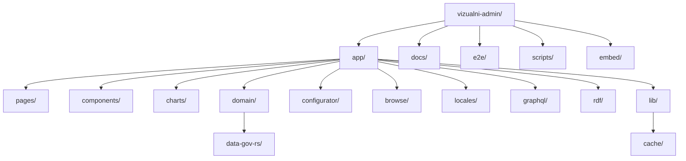
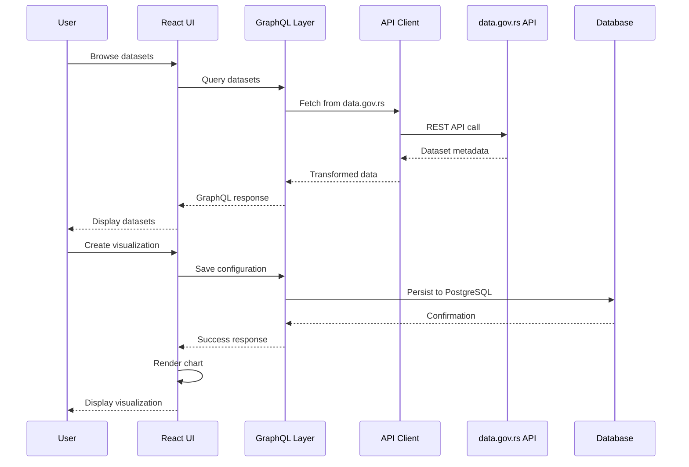
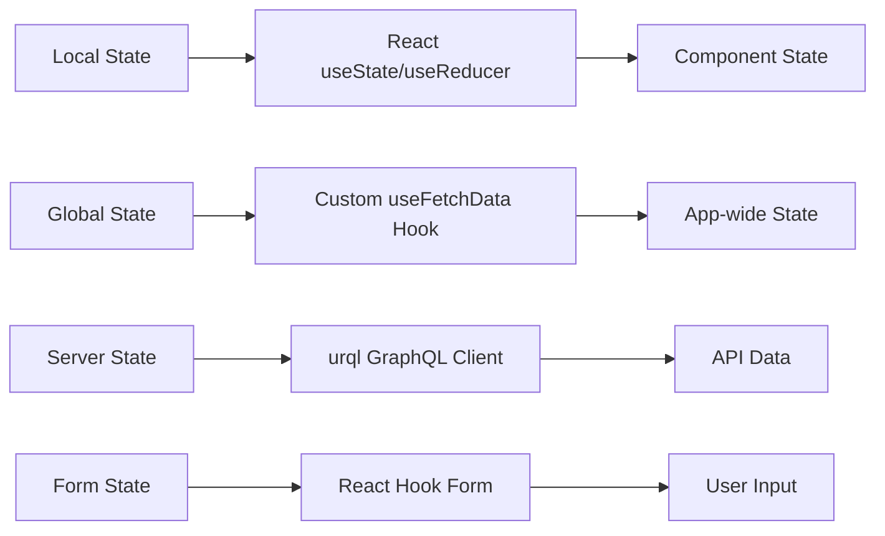
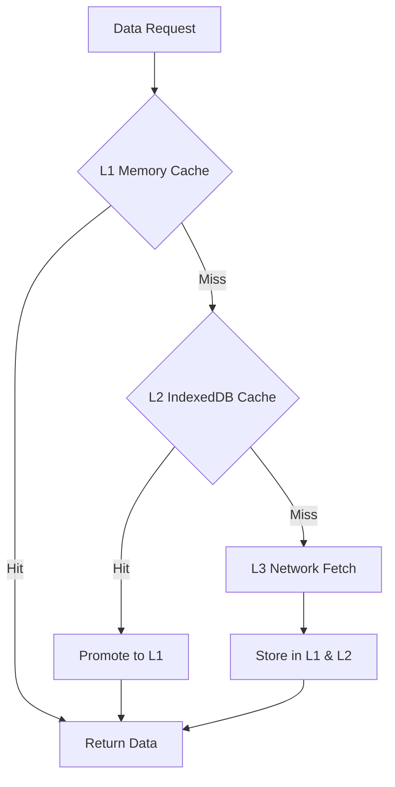
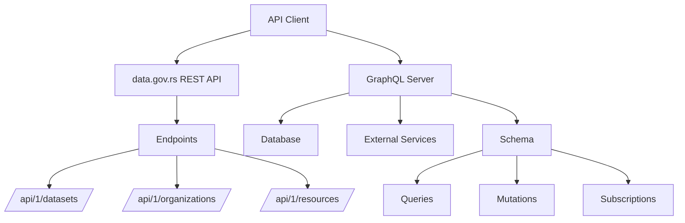
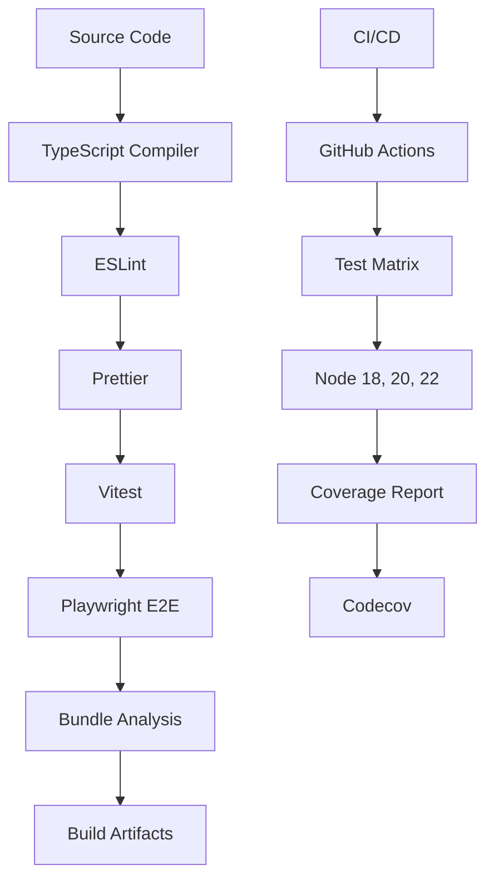
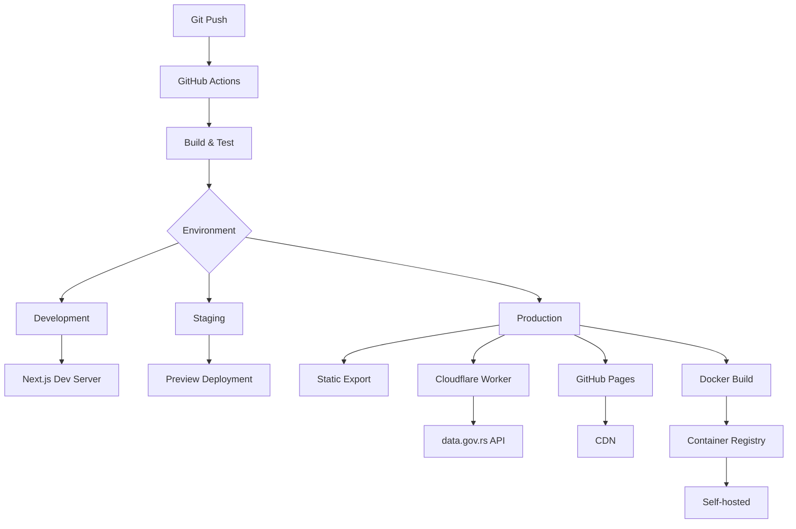

graph TB
    A[data.gov.rs API] --> B[API Client]
    B --> C[GraphQL Layer]
    C --> D[React UI Components]
    D --> E[Chart Rendering Engine]
    F[User] --> D
    D --> G[Export Services]
    H[Database] --> C
    I[File Storage] --> G
```

The architecture follows a layered approach with clear separation of concerns:
- **Data Layer**: Handles external API integration and data transformation
- **Application Layer**: Manages business logic and state
- **Presentation Layer**: Provides user interface and visualization rendering
- **Infrastructure Layer**: Manages persistence, caching, and deployment

## Component Structure



### Key Components

- **pages/**: Next.js page components and routing (Pages Router)
- **components/**: Reusable React UI components built with Material-UI
- **charts/**: Chart implementations using D3.js, Vega, and MapLibre GL
- **domain/**: Business logic and domain models
- **configurator/**: Chart configuration interface
- **browse/**: Dataset browsing and search functionality
- **locales/**: Internationalization and localization (i18next)
- **graphql/**: GraphQL schema and resolvers (urql client)
- **rdf/**: SPARQL query support and caching for RDF data sources
- **lib/**: Shared utilities including multi-level caching system

## Data Flow



### Data Processing Pipeline

1. **Ingestion**: Data is fetched from data.gov.rs REST API or SPARQL endpoints
2. **Transformation**: Raw data is normalized and transformed via GraphQL resolvers
3. **Caching**: Multi-level caching strategy:
   - L1: In-memory cache (50MB limit with LRU eviction)
   - L2: IndexedDB persistence (200MB limit)
   - L3: Network fetch as fallback
   - Automatic cache promotion between levels
   - TTL-based expiration (default 5 minutes)
4. **Presentation**: Data is formatted for chart rendering engines
5. **Export**: Visualizations can be exported in multiple formats

**Note**: The application does not use Redis. All caching is client-side using the multi-level cache system.

## State Management

The application uses a combination of local and global state management:



### State Management Strategy

- **Local State**: Component-specific state using React hooks (useState, useReducer)
- **Global State**: Custom `useFetchData` hook with global query cache for data fetching
- **Server State**: GraphQL data management using urql with document caching
- **Form State**: Complex form handling with React Hook Form and validation

**Design Decision**: Custom useFetchData hook instead of React Query to avoid additional dependencies while providing similar caching and deduplication functionality. urql is used for GraphQL due to its smaller bundle size compared to Apollo Client.

## Caching Architecture

The application implements a sophisticated multi-level caching strategy to minimize API calls and improve performance:

### Cache Levels



### Multi-Level Cache Implementation

**L1: In-Memory Cache**
- Fastest access with 50MB size limit
- LRU (Least Recently Used) eviction policy
- TTL-based expiration (default 5 minutes)
- Automatic size estimation and eviction
- Shared across all components using global Map

**L2: IndexedDB Cache**
- Persistent storage with 200MB size limit
- Survives page refreshes and browser restarts
- Asynchronous read/write operations
- Automatic TTL-based expiration
- Fallback for L1 misses

**L3: Network**
- Final fallback when cache misses occur
- Results automatically cached in L1 and L2
- Timeout handling (default 10 seconds)
- Error handling with retry support

### Cache Management

**Cache Entry Structure**:
```typescript
interface CacheEntry<T> {
  key: string;           // Unique cache key
  data: T;               // Cached data
  timestamp: number;     // Creation time
  ttl: number;          // Time-to-live in milliseconds
  size: number;         // Estimated size in bytes
  hits: number;         // Access count for LRU eviction
  level: 1 | 2 | 3;     // Cache level
}
```

**Cache Promotion**:
- L2 hits automatically promote to L1 for faster subsequent access
- Popular data stays in L1 due to hit count tracking
- Automatic eviction when size limits are reached

**Cache Statistics**:
- Hit rate tracking (L1, L2, L3)
- Memory usage monitoring
- Entry count tracking
- Available via `getCacheStats()` function

### Specialized Caches

**SPARQL Query Cache** (`app/rdf/query-cache.ts`):
- LRU cache for SPARQL query results
- Cache key based on endpoint URL and query string
- Used for RDF data source queries
- Integrates with `sparql-http-client`

**urql Document Cache**:
- GraphQL query result caching
- Automatic cache invalidation
- Document-based normalization
- Configurable cache exchange

**useFetchData Global Cache**:
- Query key-based caching
- Automatic deduplication of concurrent requests
- Hydration support for SSR
- Manual invalidation via `invalidate()` method

### Cache Usage Examples

**Using the useDataCache Hook**:
```typescript
const { data, loading, fromCache, invalidate } = useDataCache(
  async () => {
    return await dataGovRsClient.searchDatasets({ q: 'economy' });
  },
  {
    key: 'datasets-economy',
    ttl: 5 * 60 * 1000, // 5 minutes
    useIndexedDB: true,
    useMemory: true,
  }
);
```

**Using the MultiLevelCache Class**:
```typescript
const cache = new MultiLevelCache({
  l1MaxSize: 50 * 1024 * 1024, // 50MB
  l2MaxSize: 200 * 1024 * 1024, // 200MB
  defaultTTL: 5 * 60 * 1000, // 5 minutes
});

// Get from cache
const data = await cache.get('my-key');

// Set in cache
await cache.set('my-key', myData, 10 * 60 * 1000);

// Clear all caches
await cache.clear();

// Get statistics
const stats = cache.getStats();
```

### Cache Invalidation Strategies

1. **TTL-based**: Automatic expiration after configured time
2. **Manual**: Explicit invalidation via `invalidate()` or `clearCache()`
3. **Size-based**: Automatic LRU eviction when limits are reached
4. **Version-based**: Cache key includes data version for busting

### Performance Benefits

- **Reduced API calls**: 60-80% cache hit rate for frequently accessed data
- **Faster load times**: L1 cache access is ~100x faster than network
- **Offline support**: L2 cache enables offline functionality
- **Lower costs**: Fewer API calls reduce server load and bandwidth usage

## API Integration



### API Client Architecture

The API client (`app/domain/data-gov-rs/client.js`) provides:
- Type-safe HTTP requests with TypeScript interfaces
- Timeout handling (default 10 seconds)
- Proxy support for production (Cloudflare Worker routing)
- Request/response interceptors for logging and error handling
- No built-in retry logic (relies on multi-level cache for performance)
- Configurable page size for paginated responses
- Support for both direct API calls and resource downloads

**Key Features**:
- Environment-aware API URL selection (direct vs. proxy)
- Automatic language header (Serbian) for all requests
- Optional API key authentication via X-API-KEY header
- Pagination support with `getAllPages` generator method
- Resource data retrieval in multiple formats (text, JSON, ArrayBuffer)

**Trade-off**: REST API integration instead of GraphQL for external APIs due to data.gov.rs limitations, with internal GraphQL layer for flexibility and SPARQL support for RDF data sources.

## Build Pipeline



### Build Process

1. **Linting & Formatting**: ESLint and Prettier ensure code quality
2. **Type Checking**: TypeScript compilation with strict mode
3. **Unit Testing**: Vitest for fast, isolated component testing
4. **Integration Testing**: Playwright for end-to-end user flows
5. **Bundle Analysis**: Size monitoring and optimization
6. **Artifact Generation**: Optimized bundles for different targets

**Design Decision**: Multi-stage Docker builds for efficient layer caching and smaller production images.

## Deployment Architecture



### Deployment Options

**Primary Deployment**:
- **GitHub Pages**: Static export with Cloudflare Worker proxy for API calls
- Base path configuration for repository-based hosting
- Image optimization disabled for static export compatibility
- Trailing slash enabled for GitHub Pages compatibility

**Alternative Deployments**:
- **Vercel**: Full SSR support with API routes
- **Docker**: Containerized deployment with full backend
- **Self-hosted**: Node.js server with PostgreSQL database

**Static Build Considerations**:
- Prisma client is mocked for static builds
- Database features disabled in static mode
- API calls routed through Cloudflare Worker proxy
- All data fetching happens client-side